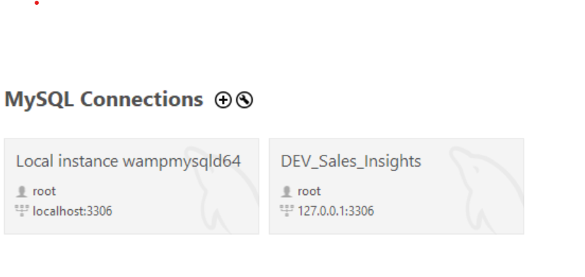
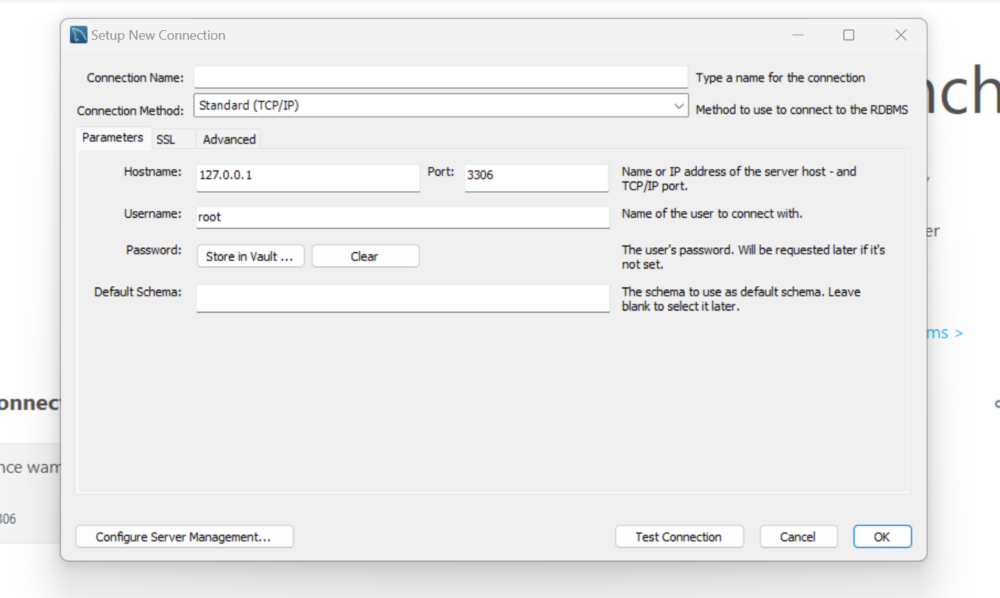
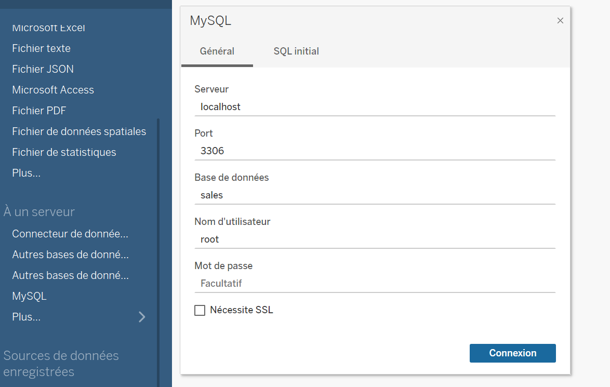
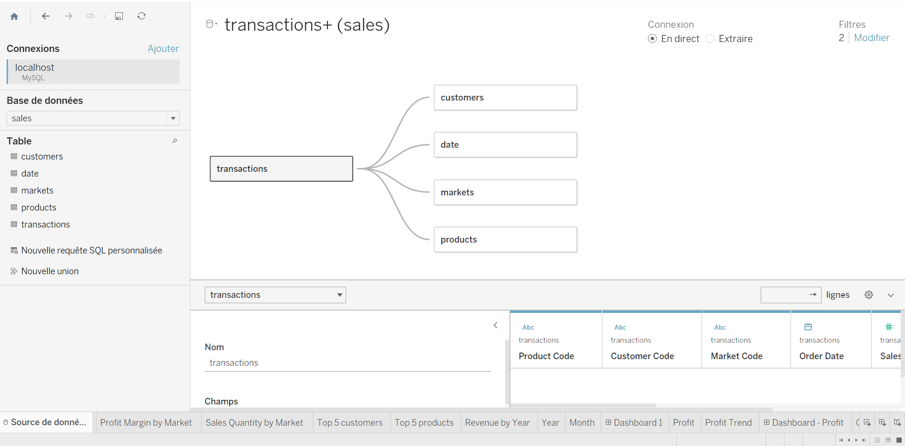

## Sales Insights data analysis using *Tableau Desktop* software

### Description
This project is part of our selt-learning  pathway in `Data Visualization`. We aim to go deeper in `Tableau Desktop` functionnalities through a real use case.
Thus, we make dashbords based on a sale history datas exported from a database. The project idea and the data are from [Dhaval Patel](https://codebasics.io/dhaval-patel) from his [Tableau Project for beginners](https://www.youtube.com/watch?v=CCNd2fUfFkk&list=PLeo1K3hjS3usDI9XeUgjNZs6VnE0meBrL&index=1).
We don't claim any rights on the `data` and its origin.

### Final result Overview

Dashboard-1             |  Dashbord Profit
:-------------------------:|:-------------------------:
 |  

### Requirements
  1. Windows system
  2. MySQL community([installation instruction](https://www.youtube.com/watch?v=WuBcTJnIuzo&t=0s))
  3. MySQL WoorkBench community ( `available on your system after installing MySQL` )
  4. Tableau Desktop ( [install here](https://www.tableau.com/products/desktop/download) )
  5. The data we used for analysis: `db_data.sql` from this repository 

  **Note :** `Tableau Desktop` is not a free software. You can use the `trial` option.

### Setup

#### A- Create `Sales` database from `MySQL WoorkBench`
  1. First, be sure that the previous requirements are satisfied
  2. Lauch `MySQL WoorkBench`
  3. From the home page, create a new `Connection` by clicking on the `+` sign after `MySQL Commection`(screenshot bellow).
     
     - You will be prompted a pop to provide a couple of information:
     
       - **Connection name** : give a name you want. In our cases, we named it `DEV_Sales_Insights`
       - Provide the `username` and `password` accordingly (by default, there is no password for `root` user.)
       - Keep default values for the other fields
       - Click the `Test connection` button to verify that everything goes well before clicking `OK`
       - **For** any issue/error while creating the collection, just `google...` it.

  4. Open your new connection by clicking on it

  5. Import the data file into your connection as bellow:
        - In the toolbar, click on : `server` > `Data import`.
        - Check `Import from self-contained file` then select the `SQL file` your download previously.
        - Move down and apply.
  6. Execute the code from the SQL file in order to create a database

#### B- Access Data from `Tableau Desktop` to make analysis

   1. Lauch `Tableau Desktop`
   2. From the sidebar, connect to our `sales` database by clicking on `MySQL`:
    
   

   4. Create a `data model` also known as `Star Sequema`)[ learn more about here"](https://help.tableau.com/current/pro/desktop/en-us/datasource_datamodel.htm)
      

   5. You can then open and try the `sales_insights_analysis.twb` file 
